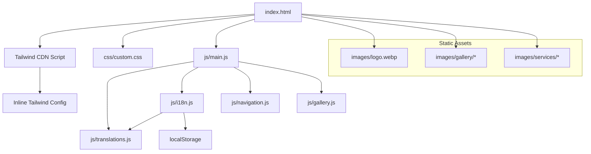
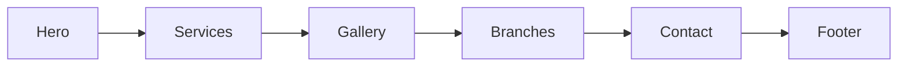

# Design Document: Heng Kimjuy Energy Website

## Overview

The Heng Kimjuy Energy website is a fully static, single-page website for a car garage and energy brand in Thailand. It uses vanilla HTML, CSS, and JavaScript — no frameworks, no build tools, no backend. The site is deployable to any static hosting provider (GitHub Pages, Netlify, S3, etc.) as a folder of files.

The site is a single `index.html` page with smooth-scroll navigation between sections: Hero, Services, Gallery, Branches, Contact, and Footer. Styling is handled by Tailwind CSS via the Play CDN (`<script src="https://cdn.tailwindcss.com"></script>`) with an inline Tailwind config for brand colors and fonts — no build step required. A minimal `css/custom.css` file covers styles that Tailwind doesn't handle natively (lightbox overlay, custom animations). A client-side i18n system handles Thai (default), English, and Chinese translations using a JS translations object and `data-i18n` attributes. Language preference persists in `localStorage`.

### Key Design Decisions

| Decision | Choice | Rationale |
|---|---|---|
| Framework | Vanilla HTML/CSS/JS | Simplest deployment, no build step, maximum performance, zero dependencies |
| Architecture | Single-page with anchor sections | Single page is sufficient for the content scope; smooth scrolling provides good UX |
| i18n approach | JS object + `data-i18n` attributes | Lightweight, no page reload, easy to maintain translations inline |
| CSS approach | Tailwind CSS via Play CDN | Utility-first with mobile-first breakpoints built-in, no build step needed, rapid prototyping with consistent design tokens |
| Image loading | Native `loading="lazy"` | Browser-native, zero JS overhead for lazy loading |
| Maps | Google Maps embed iframes | No API key needed for simple embeds, works everywhere |
| Lightbox | Custom vanilla JS lightbox | Avoids external dependency for a simple overlay feature |

## Architecture

### File Structure

```
/
├── index.html              # Single page with all sections (includes Tailwind CDN script)
├── css/
│   └── custom.css          # Custom styles Tailwind doesn't cover (lightbox overlay, animations)
├── js/
│   ├── translations.js     # i18n translation data object
│   ├── i18n.js             # Language switching logic
│   ├── navigation.js       # Hamburger menu, smooth scroll, active state
│   ├── gallery.js          # Lightbox overlay, swipe gestures
│   └── main.js             # Initialization, orchestration
├── images/
│   ├── logo.webp           # Brand logo
│   ├── hero-bg.webp        # Hero background
│   ├── gallery/            # Gallery photos
│   │   ├── photo-01.webp
│   │   ├── photo-02.webp
│   │   └── ...
│   ├── services/           # Service icons/images
│   │   └── ...
│   └── logo.ico            # Favicon
└── README.md               # Deployment instructions
```

### Architecture Diagram



### Page Section Flow



The Navigation Bar is fixed/sticky at the top and provides anchor links to each section. On mobile (<768px), it collapses into a hamburger menu.

## Components and Interfaces

### 1. HTML Structure (index.html)

The single HTML file contains semantic sections:

```html
<!DOCTYPE html>
<html lang="th">
<head>
    <meta charset="UTF-8">
    <meta name="viewport" content="width=device-width, initial-scale=1">
    <meta name="description" content="...">
    <meta property="og:title" content="...">
    <!-- ... other meta tags -->
    <!-- Tailwind CSS via Play CDN -->
    <script src="https://cdn.tailwindcss.com"></script>
    <script>
    tailwind.config = {
      theme: {
        extend: {
          colors: {
            primary: '#5FB3F9',
            secondary: '#FFFFFF',
          },
          fontFamily: {
            thai: ['Noto Sans Thai', 'sans-serif'],
            latin: ['Inter', 'sans-serif'],
            chinese: ['Noto Sans SC', 'sans-serif'],
          }
        }
      }
    }
    </script>
    <link rel="stylesheet" href="css/custom.css">
    <link rel="icon" href="images/favicon.ico">
    <!-- Google Fonts for Thai, English, Chinese -->
    <link rel="preconnect" href="https://fonts.googleapis.com">
    <link href="https://fonts.googleapis.com/css2?family=Noto+Sans+Thai:wght@400;600;700&family=Noto+Sans+SC:wght@400;600;700&family=Inter:wght@400;600;700&display=swap" rel="stylesheet">
</head>
<body class="bg-secondary text-gray-900 font-thai">
    <header class="bg-primary text-white fixed top-0 w-full z-50"> <!-- Navigation Bar --> </header>
    <main>
        <section id="hero" class="bg-primary text-white min-h-screen flex items-center justify-center"> <!-- Hero Section --> </section>
        <section id="services" class="py-16 px-4 md:px-8"> <!-- Services --> </section>
        <section id="gallery" class="py-16 px-4 md:px-8 bg-gray-50"> <!-- Gallery --> </section>
        <section id="branches" class="py-16 px-4 md:px-8"> <!-- Branches --> </section>
        <section id="contact" class="py-16 px-4 md:px-8 bg-primary text-white"> <!-- Contact --> </section>
    </main>
    <footer class="bg-gray-900 text-white py-8 px-4"> <!-- Footer --> </footer>
    <div id="lightbox" class="lightbox" role="dialog" aria-label="Image viewer" hidden> <!-- Lightbox overlay --> </div>
    <script src="js/translations.js"></script>
    <script src="js/i18n.js"></script>
    <script src="js/navigation.js"></script>
    <script src="js/gallery.js"></script>
    <script src="js/main.js"></script>
</body>
</html>
```


### 2. Navigation Component

**Responsibilities:** Section links, hamburger toggle on mobile, smooth scrolling, language switcher integration.

**Interface:**
- `initNavigation()` — Sets up hamburger toggle, smooth scroll listeners, and active section highlighting
- Hamburger button: `<button class="md:hidden p-2 min-w-[44px] min-h-[44px]" aria-label="Toggle menu" aria-expanded="false">`
- Nav links: `<a href="#services" class="block py-2 md:inline-block md:py-0 hover:text-primary/80" data-i18n="nav.services">บริการ</a>`
- Language switcher: `<select id="lang-switcher" class="bg-white text-gray-900 rounded px-2 py-1">` with options for `th`, `en`, `zh`

**Behavior:**
- Below `md` breakpoint (768px): nav links hidden (`hidden md:flex`), hamburger icon visible (`md:hidden`)
- Tap hamburger → toggle `aria-expanded`, show/hide nav links with transition
- Tap nav link → smooth scroll to section, collapse menu on mobile
- Language switcher is always visible in the nav bar (both mobile and desktop)

### 3. i18n System

**Responsibilities:** Language switching, content translation, localStorage persistence, HTML `lang` attribute update.

**Interface:**
```javascript
// translations.js — exports a translations object
const translations = {
  th: {
    "nav.home": "หน้าแรก",
    "nav.services": "บริการ",
    "nav.gallery": "แกลเลอรี",
    "nav.branches": "สาขา",
    "nav.contact": "ติดต่อเรา",
    "hero.tagline": "ศูนย์บริการรถยนต์ครบวงจร",
    // ... all translatable strings
  },
  en: { /* ... */ },
  zh: { /* ... */ }
};

// i18n.js
function setLanguage(langCode) { /* updates all data-i18n elements, persists to localStorage, updates html lang */ }
function getStoredLanguage() { /* reads from localStorage, defaults to 'th' */ }
function applyTranslations(langCode) { /* querySelectorAll('[data-i18n]') and sets textContent */ }
```

**Translation Mechanism:**
- HTML elements use `data-i18n="key.path"` attributes
- `applyTranslations()` iterates all `[data-i18n]` elements and sets `textContent` from the translations object
- `setLanguage()` updates `localStorage.setItem('lang', langCode)` and calls `applyTranslations()`
- On page load, `getStoredLanguage()` checks localStorage, falls back to `'th'`

### 4. Gallery & Lightbox Component

**Responsibilities:** Photo grid display, lightbox overlay, swipe navigation on touch devices.

**Interface:**
```javascript
function initGallery() { /* attaches click handlers to gallery items */ }
function openLightbox(imageSrc, altText) { /* shows overlay with full-size image */ }
function closeLightbox() { /* hides overlay */ }
function navigateLightbox(direction) { /* next/prev image */ }
```

**Lightbox HTML:**
```html
<div id="lightbox" class="fixed inset-0 bg-black/80 z-50 flex items-center justify-center" role="dialog" aria-label="Image viewer" hidden>
    <button class="absolute top-4 right-4 text-white text-4xl min-w-[44px] min-h-[44px]" aria-label="Close">&times;</button>
    <button class="absolute left-4 top-1/2 -translate-y-1/2 text-white text-4xl min-w-[44px] min-h-[44px]" aria-label="Previous image">&#8249;</button>
    
    <button class="absolute right-4 top-1/2 -translate-y-1/2 text-white text-4xl min-w-[44px] min-h-[44px]" aria-label="Next image">&#8250;</button>
</div>
```

**Behavior:**
- Gallery grid: Tailwind responsive grid — `grid grid-cols-1 sm:grid-cols-2 lg:grid-cols-3 gap-4`
- Click/tap image → open lightbox with full-size image
- Swipe left/right on touch → navigate between images
- Click outside image or press Escape → close lightbox
- Focus trapped inside lightbox when open (accessibility)
- Lightbox overlay styles (`fixed inset-0 bg-black/80`) are handled by Tailwind utilities; additional lightbox transition animations live in `css/custom.css`

### 5. Branch Map Component

**Responsibilities:** Display branch info and embedded Google Maps.

Each branch card contains:
- Branch name (translatable via `data-i18n`)
- Address (translatable)
- Embedded Google Maps iframe
- "Get Directions" link opening the provided Google Maps share link in a new tab

Branch cards use Tailwind grid layout: `grid grid-cols-1 md:grid-cols-2 gap-8`. Each card is styled with `bg-white rounded-lg shadow-md p-6`.

### 6. Contact Component

**Responsibilities:** Display phone, LINE, Facebook contact options as tappable buttons on mobile.

- Phone: `<a href="tel:0867016532" class="block w-full py-3 text-center bg-primary text-white rounded-lg min-h-[48px] md:inline-block md:w-auto md:px-6">086 701 6532</a>`
- LINE: `<a href="https://line.me/R/ti/p/@hengkimjuy" class="block w-full py-3 text-center bg-green-500 text-white rounded-lg min-h-[48px] md:inline-block md:w-auto md:px-6">@hengkimjuy</a>`
- Facebook: `<a href="https://www.facebook.com/hengkimjuy" target="_blank" rel="noopener noreferrer" class="block w-full py-3 text-center bg-blue-600 text-white rounded-lg min-h-[48px] md:inline-block md:w-auto md:px-6">Facebook</a>`

On mobile, these render as large tappable buttons (min 48px height, full-width) using Tailwind's `block w-full min-h-[48px]` utilities. On desktop, they switch to inline with `md:inline-block md:w-auto`.

## Data Models

Since this is a fully static site with no backend, all data is hardcoded as JavaScript objects. Below are the data structures:

### Translations Object

```javascript
const translations = {
  th: { [key: string]: string },
  en: { [key: string]: string },
  zh: { [key: string]: string }
};
```

Keys follow a dot-notation convention: `"section.element"` (e.g., `"hero.tagline"`, `"services.title"`).

### Services Data

```javascript
const services = [
  {
    id: string,          // e.g., "oil-change"
    icon: string,        // path to icon image
    titleKey: string,    // i18n key for title, e.g., "services.oilChange.title"
    descKey: string      // i18n key for description
  }
];
```

### Gallery Data

```javascript
const galleryImages = [
  {
    src: string,         // path to image file, e.g., "images/gallery/photo-01.webp"
    altKey: string       // i18n key for alt text
  }
];
```

### Branch Data

```javascript
const branches = [
  {
    id: string,          // e.g., "branch-1"
    nameKey: string,     // i18n key for branch name
    addressKey: string,  // i18n key for address
    mapEmbedUrl: string, // Google Maps embed URL
    directionsUrl: string // Google Maps share link
  }
];
// Branch 1 directions: https://share.google/uA5EzS20EZJndoAkN
// Branch 2 directions: https://share.google/aCAlHKOSAX6s9cGd7
```

### Contact Data

```javascript
const contactInfo = {
  phone: "0867016532",
  phoneDisplay: "086 701 6532",
  lineId: "@hengkimjuy",
  lineUrl: "https://line.me/R/ti/p/@hengkimjuy",
  facebookUrl: "https://www.facebook.com/hengkimjuy"
};
```

### Tailwind Theme Configuration

Brand colors and fonts are defined in the inline Tailwind config in the HTML `<head>`:

```html
<script>
tailwind.config = {
  theme: {
    extend: {
      colors: {
        primary: '#5FB3F9',
        secondary: '#FFFFFF',
      },
      fontFamily: {
        thai: ['Noto Sans Thai', 'sans-serif'],
        latin: ['Inter', 'sans-serif'],
        chinese: ['Noto Sans SC', 'sans-serif'],
      }
    }
  }
}
</script>
```

This makes brand colors available as Tailwind utilities: `bg-primary`, `text-primary`, `border-primary`, `bg-secondary`, etc. Font families are available as `font-thai`, `font-latin`, `font-chinese`.

### Custom CSS (css/custom.css)

A minimal custom CSS file handles styles that Tailwind utilities don't cover natively:

```css
/* Lightbox transition animations */
.lightbox-enter { animation: fadeIn 0.2s ease-out; }
.lightbox-exit { animation: fadeOut 0.2s ease-in; }

@keyframes fadeIn {
  from { opacity: 0; }
  to { opacity: 1; }
}

@keyframes fadeOut {
  from { opacity: 1; }
  to { opacity: 0; }
}

/* Smooth scroll behavior */
html { scroll-behavior: smooth; }
```

Font family is switched dynamically based on the active language by toggling Tailwind font classes on `<body>`:
- Thai (`th`): `font-thai`
- English (`en`): `font-latin`
- Chinese (`zh`): `font-chinese`

This is applied by the `setLanguage()` function which removes all font classes and adds the appropriate one:

```javascript
function setFontForLanguage(langCode) {
  document.body.classList.remove('font-thai', 'font-latin', 'font-chinese');
  const fontMap = { th: 'font-thai', en: 'font-latin', zh: 'font-chinese' };
  document.body.classList.add(fontMap[langCode]);
}
```


## Correctness Properties

*A property is a characteristic or behavior that should hold true across all valid executions of a system — essentially, a formal statement about what the system should do. Properties serve as the bridge between human-readable specifications and machine-verifiable correctness guarantees.*

### Property 1: Text contrast on primary background

*For any* DOM element with background color `#5FB3F9` (the primary brand color), all text within that element should have color `#FFFFFF` to maintain readability.

**Validates: Requirements 2.6**

### Property 2: Minimum touch target size

*For any* interactive element (button, link, input) on the page, its computed width and height should both be at least 44 pixels.

**Validates: Requirements 3.8**

### Property 3: Navigation scrolls to target section

*For any* navigation link in the Navigation Bar, clicking it should result in the corresponding section (identified by the link's href anchor) being scrolled into the viewport.

**Validates: Requirements 5.2**

### Property 4: Hamburger menu collapses after selection

*For any* navigation link selected from the expanded hamburger menu (viewport < 768px), the menu should collapse (aria-expanded set to "false") after the link is activated.

**Validates: Requirements 5.5**

### Property 5: Service cards contain required information

*For any* service defined in the services data, the rendered service card should contain a title element, an icon or image element, and a description element, each with non-empty content.

**Validates: Requirements 6.1, 6.2**

### Property 6: Gallery images rendered with lazy loading

*For any* image defined in the gallery data, there should be a corresponding `` element in the gallery section with `loading="lazy"` attribute set.

**Validates: Requirements 7.1, 7.4**

### Property 7: Gallery lightbox opens on image click

*For any* image in the gallery grid, clicking/tapping it should open the lightbox overlay displaying that image's full-size source.

**Validates: Requirements 7.2**

### Property 8: Branch cards contain complete information

*For any* branch defined in the branch data, the rendered branch card should contain the branch name, address, an embedded map iframe, and a "Get Directions" link with `target="_blank"` pointing to the correct Google Maps URL.

**Validates: Requirements 8.2, 8.3**

### Property 9: All images have alt text

*For any* `` element on the page, the `alt` attribute should be present and non-empty.

**Validates: Requirements 12.2**

### Property 10: Interactive elements are keyboard accessible

*For any* interactive element (buttons, links, language switcher, lightbox controls) on the page, it should be focusable via keyboard Tab navigation and activatable via Enter or Space key.

**Validates: Requirements 12.3**

### Property 11: Language switch updates all translatable content

*For any* language code (`th`, `en`, `zh`) and *for any* DOM element with a `data-i18n` attribute, after calling `setLanguage(langCode)`, the element's text content should equal the value at the corresponding key in `translations[langCode]`.

**Validates: Requirements 13.4**

### Property 12: Language switch updates lang attribute and localStorage

*For any* language code (`th`, `en`, `zh`), after calling `setLanguage(langCode)`, the `<html>` element's `lang` attribute should equal `langCode` and `localStorage.getItem('lang')` should equal `langCode`.

**Validates: Requirements 13.5, 13.7**

### Property 13: Language preference round-trip persistence

*For any* language code (`th`, `en`, `zh`), if `setLanguage(langCode)` is called and then `getStoredLanguage()` is called (simulating a page reload reading from localStorage), the returned value should equal `langCode`.

**Validates: Requirements 13.8**

## Error Handling

Since this is a fully static site with no backend, error handling is minimal and focused on graceful degradation:

| Scenario | Handling |
|---|---|
| Image fails to load | The `alt` attribute provides descriptive fallback text. CSS can style broken image placeholders. |
| Google Maps embed fails | The iframe shows Google's default error. The "Get Directions" link still works as a fallback. |
| JavaScript disabled | Core content (HTML) is still visible. Navigation links work as anchor jumps. Translations default to Thai (hardcoded in HTML). Lightbox and hamburger menu degrade gracefully. |
| localStorage unavailable | `getStoredLanguage()` catches the error and falls back to `'th'`. Language switching still works for the current session. |
| Unsupported browser | Progressive enhancement: base styles work everywhere. CSS Grid falls back to block layout. `loading="lazy"` is ignored by older browsers (images load normally). |
| Font loading failure | System fonts serve as fallback in the font stack (`sans-serif`). |

### localStorage Error Handling

```javascript
function getStoredLanguage() {
  try {
    return localStorage.getItem('lang') || 'th';
  } catch (e) {
    return 'th'; // fallback if localStorage is blocked (e.g., private browsing)
  }
}

function persistLanguage(langCode) {
  try {
    localStorage.setItem('lang', langCode);
  } catch (e) {
    // silently fail — language works for current session
  }
}
```

## Testing Strategy

### Unit Tests (Example-Based)

Unit tests verify specific, concrete behaviors using a DOM testing approach (e.g., jsdom with a test runner like Vitest or Jest):

- **SEO meta tags exist**: Verify `<meta name="description">`, `<meta property="og:title">`, viewport meta tag, and favicon link are present (Requirements 11.1, 11.2, 11.4, 3.7)
- **Semantic HTML structure**: Verify `<header>`, `<nav>`, `<main>`, `<section>`, `<footer>` elements exist (Requirement 11.3)
- **Navigation links present**: Verify links to Home, Services, Gallery, Branches, Contact exist in the nav (Requirement 5.1)
- **Hero section content**: Verify logo, brand name, and tagline elements exist (Requirement 4.1)
- **Default language is Thai**: With empty localStorage, verify the page loads with `lang="th"` and Thai content (Requirement 13.2)
- **Translations object completeness**: Verify `th`, `en`, `zh` keys exist in translations (Requirement 13.1)
- **Language switcher in nav**: Verify the language switcher element is inside the navigation bar (Requirement 13.10)
- **Contact details**: Verify phone number with `tel:` link, LINE link, Facebook link with `target="_blank"` (Requirements 9.1–9.4)
- **Footer content**: Verify copyright with current year, social links, phone number (Requirements 10.1–10.3)
- **Branch count**: Verify exactly 2 branches are rendered (Requirement 8.1)
- **Tailwind brand colors configured**: Verify the Tailwind config defines `primary: '#5FB3F9'` and `secondary: '#FFFFFF'` (Requirement 2.5)
- **Hamburger menu visible on mobile**: At viewport < 768px, verify hamburger button is visible and nav links are hidden (Requirement 5.3)

### Property-Based Tests

Property-based tests use a PBT library (e.g., **fast-check** for JavaScript) to verify universal properties across generated inputs. Each test runs a minimum of 100 iterations.

Each property test references its design document property with a tag comment:

```javascript
// Feature: heng-kimjuy-energy-website, Property 11: Language switch updates all translatable content
test.prop('all data-i18n elements update on language switch', [fc.constantFrom('th', 'en', 'zh')], (langCode) => {
  setLanguage(langCode);
  document.querySelectorAll('[data-i18n]').forEach(el => {
    const key = el.getAttribute('data-i18n');
    expect(el.textContent).toBe(translations[langCode][key]);
  });
});
```

**Property tests to implement:**

1. **Property 1** — Text contrast on primary background: Generate elements with blue background, verify white text
2. **Property 2** — Touch target size: For all interactive elements, verify ≥ 44px dimensions
3. **Property 3** — Navigation scrolls to target: For all nav links, verify scroll to correct section
4. **Property 4** — Hamburger collapse: For all nav links in mobile menu, verify menu collapses after click
5. **Property 5** — Service cards: For all services data entries, verify card contains title, icon, description
6. **Property 6** — Gallery lazy loading: For all gallery data entries, verify img with `loading="lazy"`
7. **Property 7** — Lightbox opens: For all gallery images, verify lightbox opens on click
8. **Property 8** — Branch cards: For all branch data entries, verify name, address, map, directions link
9. **Property 9** — Image alt text: For all img elements, verify non-empty alt attribute
10. **Property 10** — Keyboard accessibility: For all interactive elements, verify focusable and activatable
11. **Property 11** — Language content update: For all languages × all `data-i18n` elements, verify correct translation
12. **Property 12** — Lang attribute + localStorage: For all languages, verify html lang and localStorage update
13. **Property 13** — Language persistence round-trip: For all languages, verify set → get returns same value

### Testing Tools

| Tool | Purpose |
|---|---|
| **Vitest** | Test runner (fast, ESM-native) |
| **jsdom** | DOM environment for unit and property tests |
| **fast-check** | Property-based testing library for JavaScript |
| **@testing-library/dom** | DOM querying utilities for tests |

### Test Configuration

- Property tests: minimum 100 iterations per property (`{ numRuns: 100 }`)
- Each property test tagged with: `Feature: heng-kimjuy-energy-website, Property {N}: {title}`
- Tests run via `vitest --run` (single execution, no watch mode)
