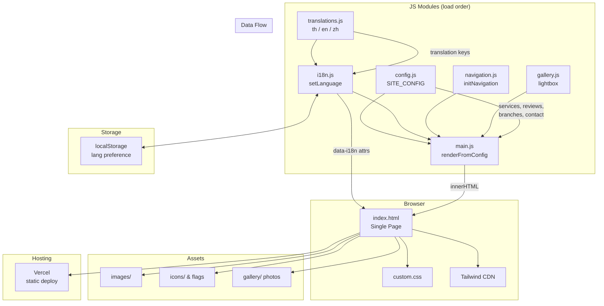

# Project Structure

```
├── index.html              # Single-page app entry point (all sections)
├── css/
│   └── custom.css          # Minimal custom CSS (lightbox animations, scroll hiding)
├── js/
│   ├── config.js           # SITE_CONFIG — all content, URLs, services, reviews, branches
│   ├── translations.js     # Translation strings for th/en/zh
│   ├── i18n.js             # Language switching logic (localStorage, DOM updates, fonts)
│   ├── navigation.js       # Hamburger menu, smooth scroll, active section highlighting
│   ├── gallery.js          # Lightbox overlay, keyboard/touch navigation, focus trapping
│   ├── main.js             # DOMContentLoaded init, renders config into DOM
│   └── i18n.test.js        # Vitest tests for i18n module
├── images/
│   ├── gallery/            # Local gallery photos
│   ├── icons/              # Service icons (GIF), language flags (PNG), social icons
│   ├── og-preview/         # Open Graph preview images
│   ├── services/           # Service images (placeholder)
│   ├── logo.webp           # Brand logo
│   └── hero-bg.webp        # Hero background (fallback; config uses Unsplash URL)
├── vercel.json             # Vercel routing config
├── vitest.config.js        # Vitest config (jsdom environment)
└── package.json            # Dev dependencies only (vitest, jsdom, fast-check)
```

## Architecture Diagram



## Architecture Pattern
- Content-driven: all site data lives in `js/config.js` (`SITE_CONFIG` object). To update content (services, reviews, branches, contact info), edit config.js only.
- Translations live in `js/translations.js` as a flat key-value map per language.
- `main.js` reads `SITE_CONFIG` on load and renders HTML into placeholder containers via `innerHTML`.
- i18n uses `data-i18n` attributes for text and `data-i18n-alt` for image alt text.
- Script load order matters: config → translations → i18n → navigation → gallery → main.

## Conventions
- New content sections: add data to `config.js`, add translation keys to `translations.js`, add a `<section>` to `index.html`, render in `main.js`.
- Tests go alongside source files in `js/` with `.test.js` suffix.
- Images organized by purpose: `gallery/`, `icons/`, `og-preview/`, `services/`.
